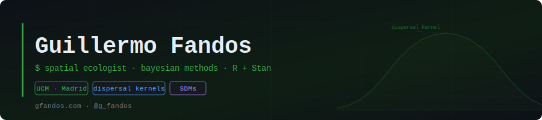

---

### 👋 About me

Assistant Professor (Profesor Ayudante Doctor) at the Complutense University of Madrid. Spatial ecologist and conservation scientist.
I combine field data, citizen science, and Bayesian modelling to understand why animals are where they are and what will happen to them under global change.

---

### 🔬 Research lines

- **Animal dispersal** — empirical kernels from ringing data; intraspecific variation across European birds
- **Species distribution modelling** — integrating correlative and mechanistic approaches
- **Movement ecology** — linking individual movement to population and community dynamics
- **Biodiversity monitoring** — bias correction, citizen science, dynamic occupancy models

---

### 🛠️ Tools

---

### 📦 Active projects

| Project | Description |
|---|---|
| [dispersalR](https://github.com/guifandos/dispersalR) | R package for fitting and comparing empirical dispersal kernels |
| INTRADISP | Intraspecific variation in dispersal in European birds — EURING + Bayesian/Stan · *(in progress)* |
| RIMED-FAUNA | Mediterranean river fauna distribution and dynamics · *(in progress)* |

---

### 📄 Selected publications

- **Fandos et al. (2026)** — Simple mechanistic traits outperform complex syndromes in predicting avian dispersal distances. *Communications Biology* · [DOI](https://doi.org/10.1038/s42003-026-09676-x)
- **Fandos et al. (2023)** — Standardised empirical dispersal kernels emphasise the pervasiveness of long-distance dispersal in European birds. *Journal of Animal Ecology* · [DOI](https://doi.org/10.1111/1365-2656.13838)
- **Pratzer, Nill, Kuemmerle, Zurell & Fandos (2023)** — Large carnivore range expansion in Iberia in relation to different scenarios of permeability of human-dominated landscapes. *Diversity and Distributions* · [DOI](https://doi.org/10.1111/ddi.13645)

---

### 🌐 Find me

